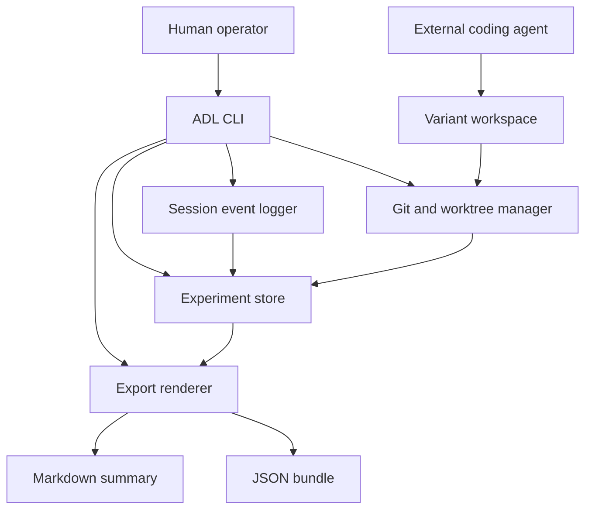
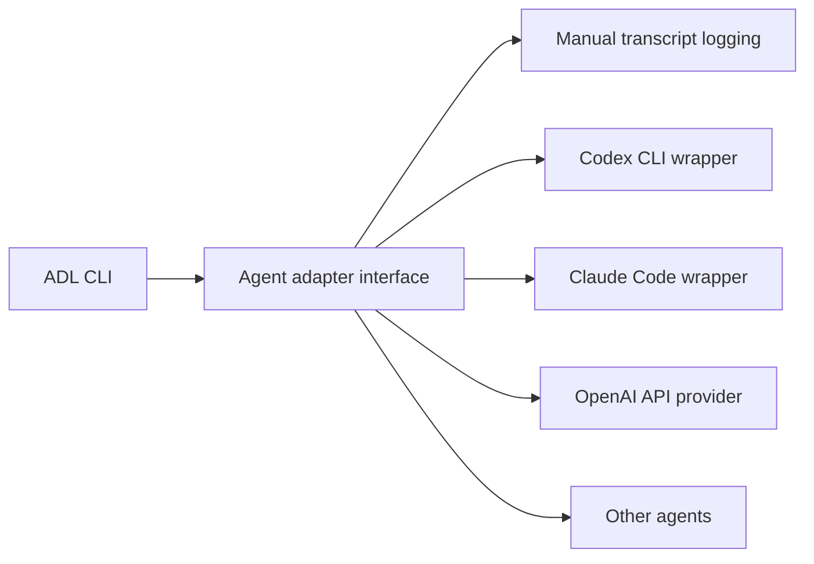

# Design

## Architecture Overview

Agent Decision Lab is a CLI and local metadata store layered on top of Git.

It does not replace the coding agent. In the MVP, the user can keep using
Codex, Claude Code, Gemini CLI, Copilot CLI, OpenCode, or any other tool. The
Lab records the decision tree and binds each path to Git state.



## Repository Roles

There are two repository types:

### Tool Repository

This repository. It contains the generic CLI, schemas, docs, tests, and
synthetic examples.

### Experiment Workspace

The target repository where a user runs experiments. It contains `.agent-lab/`
metadata, private transcripts, branch mappings, and artifacts for that
experiment.

The tool repository must not contain real private experiment data.

## Storage Model

The default store is file-backed and local:

```text
.agent-lab/
  config.json
  experiments/
    <experiment-id>/
      experiment.json
      tree.json
      events.jsonl
      artifacts.json
      variants/
        <variant-id>.json
      exports/
        latest.json
        latest.md
```

The store should be simple enough to inspect manually and strict enough to
validate with schemas.

## Core Entity Model

### Core Relationship

The experiment tree separates questions from restorable state:

```text
Experiment
  -> Decision Point: the question being tested
      -> Savepoint: the Git and context state that can be forked again
          -> Variant: one choice made from that savepoint
              -> Decision Point: a later nested question
```

A decision point is not enough by itself. It must have a savepoint when the user
needs to return later and create another clean branch from the same state.

### Experiment

```json
{
  "schemaVersion": "agent-decision-lab/v1",
  "id": "exp_20260703_checkout_flow",
  "title": "Improve Checkout Flow",
  "description": "Compare collaboration strategies while improving checkout validation in a toy app.",
  "createdAt": "2026-07-03T10:00:00.000Z",
  "baseRepository": {
    "path": "/path/to/repo",
    "remote": "git@example.com:org/repo.git",
    "baseRef": "main",
    "baseCommit": "abc123"
  },
  "privacy": {
    "classification": "private",
    "redactionProfile": "default"
  }
}
```

### Decision Point

```json
{
  "id": "dec_context_strategy",
  "type": "decision",
  "title": "Context strategy",
  "rationale": "Compare outcomes when the agent does or does not receive project guidance before design.",
  "parentId": "root",
  "createdAt": "2026-07-03T10:10:00.000Z"
}
```

### Savepoint

```json
{
  "id": "sp_read_guidance",
  "type": "savepoint",
  "decisionId": "dec_context_strategy",
  "title": "Read project guidance?",
  "rationale": "Preserve the state before choosing how much project guidance context the agent sees.",
  "git": {
    "commit": "abc123",
    "branch": "main",
    "isDirty": false
  },
  "context": {
    "policy": "pre-decision",
    "artifacts": []
  },
  "parentVariantId": null,
  "createdAt": "2026-07-03T10:12:00.000Z"
}
```

A savepoint is the fork anchor. Starting another strategy later should create a
new branch or worktree from `git.commit`, not from whichever branch the user is
currently on.

### Variant

```json
{
  "id": "var_guidance_first",
  "type": "variant",
  "decisionId": "dec_context_strategy",
  "savepointId": "sp_read_guidance",
  "name": "guidance-first",
  "promptSummary": "Agent reads project guidance before design.",
  "branch": "adl/exp-checkout-flow/guidance-first",
  "worktreePath": "../agent-lab-worktrees/guidance-first",
  "baseCommit": "abc123",
  "currentCommit": "def456",
  "status": "active"
}
```

### Event

Events are append-only JSON lines.

```json
{
  "id": "evt_001",
  "type": "prompt",
  "experimentId": "exp_20260703_checkout_flow",
  "variantId": "var_guidance_first",
  "createdAt": "2026-07-03T10:20:00.000Z",
  "actor": "human",
  "body": "Please design the checkout validation change after reading the project guidance.",
  "metadata": {
    "agent": "codex",
    "model": "gpt-5",
    "contextPolicy": "guidance-visible"
  }
}
```

## CLI Design

The exact command names can change, but the first implementation should support
these workflows.

### Initialize

```bash
adl init "Improve Checkout Flow"
```

Creates `.agent-lab/`, records base Git state, and creates the root experiment.

### Create a Decision Point

```bash
adl decision create "Context strategy" \
  --rationale "Compare standard-visible and prompt-only development"
```

### Create a Savepoint

```bash
adl savepoint create "Read project guidance?" \
  --decision context-strategy \
  --rationale "Fork strategies from the same pre-context state"
```

The savepoint records the current commit and context policy. The CLI should
refuse to create a savepoint from a dirty working tree unless the user explicitly
chooses a metadata-only checkpoint that cannot be used for clean Git forking.

### Start a Variant

```bash
adl variant start guidance-first \
  --from read-guidance \
  --worktree
```

Creates or attaches a branch and optional worktree from the savepoint commit.

### Run A Case Study Workflow

The high-level case-study commands bundle the common primitive sequence without
introducing a separate data model:

```bash
adl case-study init "Review JSON Case Study" \
  --decision "Context strategy" \
  --savepoint "Before task"
adl case-study add-variant docs-visible --from before-task --worktree
adl case-study record-result docs-visible \
  --artifact outputs/docs-visible.patch \
  --strengths "small proof" \
  --weaknesses "loose assertions" \
  --evidence "npm test passed" \
  --no-score
adl case-study export docs-visible prompt-only --out-dir .agent-lab/exports/case
```

`case-study add-variant` creates the variant and records strategy metadata.
`case-study record-result` registers artifacts and records qualitative or scored
evaluations. `case-study export` writes comparison, guidance, SVG, HTML,
Markdown, and JSON outputs.

### Guided First Run

```bash
adl lab start "Agent Strategy Lab" \
  --decision "Context visibility" \
  --savepoint "Before strategy fork" \
  --variants docs-visible,prompt-only \
  --worktree
```

The guided command refuses dirty non-lab files, creates the experiment,
decision, clean savepoint, variants, and strategy metadata, then prints the next
safe commands.

### Context Orientation

```bash
adl whereami
adl whereami --json
```

The context command reports whether the operator is in the base lab checkout, a
registered variant worktree, or an unknown checkout. It never prints raw prompt
or response bodies.

### Privacy And Insight Commands

```bash
adl privacy audit --path .agent-lab/exports --json
adl insight export --variants docs-visible,prompt-only \
  --out .agent-lab/exports/insight-pack.json
```

Privacy audit is a preflight for public sharing. Insight export is a bounded,
redacted package for review and analysis.

### MCP Adapter

```bash
adl mcp serve
```

The first MCP adapter is a local stdio recorder. It exposes doctor, status,
whereami, tree, orchestrate, event logging, checkpoint, command metadata
recording, and redacted summary export tools. It does not execute shell
commands or call model providers.

### Inspect Worktrees

```bash
adl worktree list
adl worktree status
adl worktree cleanup --dry-run
```

Worktree lifecycle commands operate only on worktrees recorded in variant
metadata. Cleanup remains dry-run-only in the MVP.

### Log Session Events

```bash
adl log prompt --stdin
adl log response --stdin
adl log note "The agent asked for acceptance criteria before coding."
adl checkpoint "Design approved"
```

Manual logging is enough for MVP. Agent adapters can automate this later.

### Render and Export

```bash
adl tree
adl export --format markdown --out .agent-lab/exports/latest.md
adl export --format json --out .agent-lab/exports/latest.json
adl export --format svg --out .agent-lab/exports/tree.svg
adl export --format html --out .agent-lab/exports/report.html
```

When the target repository already has experiment data, create a separate
experiment instead of replacing `.agent-lab/`:

```bash
adl experiment create "Bald Patch Case Study"
adl experiment list
adl experiment switch "Bald Patch Case Study"
```

Command output can be captured without a model-provider dependency:

```bash
adl run --variant prompt-only -- npm test
```

Noisy commands can be captured without flooding the active terminal:

```bash
adl run --quiet --variant prompt-only -- npm test
adl run --tail 30 --variant prompt-only -- npm test
```

To resume or replay work:

```bash
adl variant checkout prompt-only
adl savepoint checkout read-guidance --branch adl/replay/read-guidance
```

### Guided Operation And Realtime UI

The MVP includes local operator surfaces for the common loop:

```bash
adl ui --host 127.0.0.1 --port 8787
adl orchestrate prompt-only
adl rebuild init "Blank Rebuild" --keep AGENTS.md --variants docs-visible,prompt-only --worktree
```

`adl ui` starts a dependency-free local HTTP server with controls for case-study
initialization, variant creation, note logging, HTML export, doctor checks, and
realtime state streaming over Server-Sent Events.

`adl orchestrate` does not call a model. It renders the next operator route,
the metadata command location, the variant worktree, and the prompt context to
use with an external agent.

`adl rebuild init` creates a clean rebuild lab from a preserved file set so
multiple agents can attempt a reconstruction from the same blank baseline.

## Branch and Worktree Strategy

Each variant should have one Git branch. Worktrees are optional but recommended
when variants may be developed concurrently or need separate runtime state.

Default branch pattern:

```text
adl/<experiment-slug>/<variant-slug>
```

Default worktree pattern:

```text
../<repo-name>-agent-lab/<experiment-slug>/<variant-slug>
```

The Git manager must:

- create new variant branches from the savepoint commit;
- detect dirty working trees before switching or branching;
- record base commit and current commit;
- avoid deleting worktrees or branches without explicit confirmation;
- support attaching an existing branch or worktree;
- support checking out a recorded variant branch;
- support creating or checking out a branch from a savepoint commit;
- expose enough status to recover from interrupted runs.

Returning to a savepoint must not rewrite or discard the current path. It should
create a new branch or worktree that starts from the saved commit.

## Model and Agent Integration

The MVP should not depend on one model provider.

The design should leave room for adapters:



Adapter and plugin recipe responsibilities:

- capture submitted prompts;
- capture visible responses;
- record model/tool metadata when available;
- associate outputs with the active experiment variant;
- avoid hidden prompt injection.

The first release implements provider-neutral recipes instead of executable
provider integrations:

```bash
adl adapter list
adl adapter show manual
adl adapter scaffold manual --out .agent-lab/adapters/manual.md
adl plugin scaffold command-wrapper --variant docs-visible
```

These recipes document how to use ADL as the recorder around a human-operated
agent or local command. Direct model orchestration remains a later layer.

## Export Design

Exports should be deterministic and stable enough for analysis.

The JSON export should include:

- experiment metadata;
- tree nodes;
- savepoints and their Git anchors;
- variants;
- event summaries or full event bodies depending on privacy settings;
- artifact index;
- Git state;
- test/check results;
- manual scores;
- qualitative no-score findings;
- redaction metadata.

When redaction is enabled, exports must redact common credentials and local
filesystem paths such as worktree locations. Public exports should show
`[REDACTED_LOCAL_PATH]` instead of paths under user home directories or local
temporary directories.

The Markdown export should include:

- executive summary;
- decision tree;
- savepoint and fork summary;
- variant comparison table;
- artifacts;
- open questions;
- next actions.

The HTML export should act as a compact dashboard with decision tree, variant
table, artifact table, command runs, qualitative findings, privacy/redaction
status, and export freshness.

## Realtime UI

`adl ui` starts a local dependency-free HTTP server for operating a lab:

```bash
adl ui --host 127.0.0.1 --port 8787
```

The UI exposes local controls for case-study initialization, variant creation,
note logging, and HTML export. It renders the same decision tree and recent
events as the CLI. Realtime updates use Server-Sent Events from `/api/events`;
the browser receives current state immediately and then periodic state refreshes.

The UI is intentionally not a hosted dashboard. It runs on the operator's
machine and writes only target-local `.agent-lab/` metadata.

## Guided Operation

The CLI now includes higher-level operating modes:

- `adl orchestrate` prints the next route, worktree, prompt block, and metadata
  versus code-work boundaries.
- `adl rebuild init` creates a blank rebuild lab in an isolated worktree while
  preserving requested `--keep` files.
- `adl run --quiet` and `adl run --tail N` keep noisy command evidence usable
  in guided sessions.

## Error Handling

The CLI should prefer fail-closed behavior for operations that may lose data.

Examples:

- refuse to start a variant if the target worktree path already exists and is
  not registered;
- refuse to switch branches with uncommitted changes unless the user explicitly
  attaches or checkpoints;
- warn before exporting full transcripts;
- validate metadata files before writing derived exports;
- preserve append-only event logs even if rendering fails.

## Open Questions

- Should the CLI provide a lightweight TUI in the MVP or stay command-only?
- Should checkpoints create Git commits, only metadata events, or support both?
- Should redaction run at log time, export time, or both?
- Should experiments be stored in the target repo or in a separate lab repo?
- Should `savepoint create` require a clean working tree for every forkable
  savepoint, and use a separate metadata-only checkpoint command for dirty
  states?

## Decided Defaults

- The Agent Decision Lab repository ignores `.agent-lab/` by default so private
  experiment data does not enter the open-source tool repository.
- Shareable evidence should be exported through redacted JSON, Markdown, SVG, or
  HTML reports instead of committing raw experiment state.
