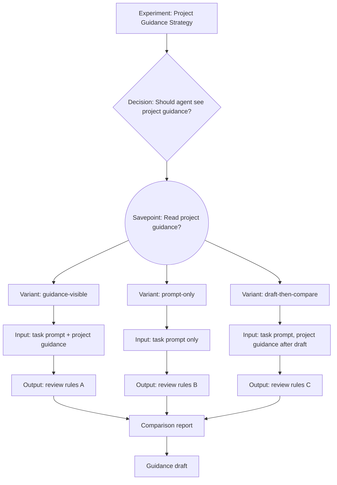

# Strategy Experiment Layer Design

## Purpose

Agent Decision Lab should help humans evaluate agent collaboration strategies,
not only record branches and transcripts.

The next version adds a strategy experiment layer for A/B-style decisions such
as:

> Should an agent read a Software Quality Management document before writing
> code review rules, or should it receive only the code-review task prompt to
> avoid excess context and interference?

The goal is to make this kind of decision explicit, branchable, measurable,
visual, and reusable. A completed experiment should produce a decision tree, a
comparison report, and a draft guidance document that can become an agent
collaboration playbook.

## Product Thesis

The product should become an experiment ledger and comparison engine for human
agent collaboration strategies.

It should not become a hidden prompt injector, a model runner, or a generic
parallel-agent dashboard. Agent Decision Lab should preserve what strategy was
chosen, what context each variant saw, what the agent produced, how the outputs
were evaluated, and what guidance the human learned.

## Core Model Correction

The strategy layer depends on a sharper tree model than the current MVP.

| Concept | Meaning | Git Role |
| --- | --- | --- |
| Decision point | The question being tested, such as "Read project guidance?" | Names the fork reason |
| Savepoint | The restorable state where the question can be answered again | Records the commit used to fork clean variants |
| Variant | One choice made from a savepoint | Owns a branch or worktree |
| Nested decision | A later question that appears inside one variant | Creates another savepoint under that path |

A decision point is the question. A savepoint is the forkable state. A variant
is one answer pursued from that state.

This distinction is mandatory. If the tool treats a decision point as only a
label, users cannot safely return later and grow a third or fourth branch from
the same conditions.

## First Success Case

The first real case study is the Software Quality Management context experiment.

### Experiment Question

Should the agent read the user's Software Quality Management planning document
before writing code review rules?

### Decision

Context visibility.

### Savepoint

`Read project guidance?`

The savepoint is created before any variant-specific project guidance exposure. It records
the Git commit, baseline context, and the fact that no branch-specific project guidance
decision has been made yet.

### Variant A: `guidance-visible`

The agent receives:

- the code review rule writing task;
- the Software Quality Management planning document;
- any baseline repository guidance that both variants are allowed to see.

Hypothesis:

The agent may produce richer, more aligned rules because it understands the
quality philosophy, risk model, and process expectations.

Risks:

- overfitting to planning language;
- producing broad quality-process commentary instead of concrete review rules;
- importing irrelevant policy into code review behavior.

### Variant B: `prompt-only`

The agent receives:

- the code review rule writing task;
- the same baseline repository guidance as Variant A;
- no Software Quality Management planning document.

Hypothesis:

The agent may produce more focused rules with fewer distractions.

Risks:

- missing the user's real quality philosophy;
- producing generic review rules;
- failing to encode project-specific quality tradeoffs.

### Desired Output

Each variant should produce code review rules. The experiment should then
compare the outputs and derive guidance about when to show planning documents
to agents.

## User Workflow

The intended workflow stays CLI-first.

```bash
adl init "Project Guidance Strategy for Code Review Rules"

adl template context-ab \
  --question "Should the agent read project guidance before writing code review rules?" \
  --decision "Context visibility" \
  --a guidance-visible \
  --b prompt-only

adl savepoint create "Read project guidance?" \
  --decision context-visibility \
  --rationale "Fork all project guidance visibility strategies from the same clean state"

adl strategy set guidance-visible \
  --from read-project-guidance \
  --context-policy guidance-visible \
  --hypothesis "project guidance context improves alignment with quality philosophy" \
  --risk "May overfit planning text or become too broad"

adl strategy set prompt-only \
  --from read-project-guidance \
  --context-policy prompt-only \
  --hypothesis "Focused prompt improves rule specificity" \
  --risk "May miss quality philosophy and produce generic rules"

adl strategy set draft-then-compare \
  --from read-project-guidance \
  --context-policy delayed-guidance \
  --hypothesis "Drafting first then checking project guidance may balance focus and alignment" \
  --risk "May require extra review effort"

adl log prompt --variant guidance-visible --stdin
adl log artifact --variant guidance-visible --path outputs/guidance-visible-rules.md
adl evaluate guidance-visible --rubric code-review-rule-quality

adl log prompt --variant prompt-only --stdin
adl log artifact --variant prompt-only --path outputs/prompt-only-rules.md
adl evaluate prompt-only --rubric code-review-rule-quality

adl compare guidance-visible prompt-only \
  --rubric code-review-rule-quality \
  --out .agent-lab/experiments/<id>/exports/comparison.md

adl export --format mermaid --out .agent-lab/experiments/<id>/exports/tree.mmd
adl guidance draft --out .agent-lab/experiments/<id>/exports/guidance.md
```

This command surface is intentionally illustrative. Implementation may adjust
exact names, but the data model must support these behaviors.

## Required Savepoint Behavior

The next implementation must support repeated forks from the same savepoint.

Example:

```bash
adl branch start guidance-visible --from read-project-guidance --worktree
adl branch start prompt-only --from read-project-guidance --worktree
adl branch start draft-then-compare --from read-project-guidance --worktree
```

All three branches must start from the savepoint's recorded commit. They must
not start from whichever branch happens to be checked out when the command runs.

Returning to a savepoint never rewrites the current path. It creates a new clean
branch or worktree from the saved state.

## New Concepts

### Savepoint

A savepoint is a named, forkable state in the experiment tree.

Fields:

- `id`: stable savepoint id.
- `decisionId`: decision this savepoint answers.
- `title`: human-readable savepoint name.
- `rationale`: why this state should be preserved.
- `gitCommit`: commit used as the branch start point.
- `gitBranch`: branch where the savepoint was created.
- `isDirty`: whether the state was dirty when captured.
- `contextPolicy`: context state before branch-specific choices.
- `artifactRefs`: artifacts that define the pre-branch state.
- `parentVariantId`: variant containing this savepoint, or `null` for root.
- `createdAt`: timestamp.

Forkable savepoints should require `isDirty: false`. Dirty states can be logged
as checkpoints, but they should not be advertised as clean branch anchors.

### Strategy

A strategy describes how a variant collaborates with the agent.

Fields:

- `id`: stable strategy id.
- `variantId`: variant that uses the strategy.
- `savepointId`: savepoint this strategy branched from.
- `label`: human-readable name.
- `contextPolicy`: short policy label, such as `guidance-visible` or
  `prompt-only`.
- `promptPolicy`: how the prompt was constructed.
- `visibleContext`: list of context artifacts or policy labels the agent saw.
- `withheldContext`: list of context artifacts or policy labels intentionally
  withheld.
- `hypothesis`: expected benefit.
- `risks`: expected failure modes.
- `controls`: conditions kept equal across variants.
- `createdAt`: timestamp.

### Rubric

A rubric defines how outputs will be evaluated.

The first rubric should be generic enough for code review rule quality:

- alignment with stated goal;
- specificity and actionability;
- signal-to-noise ratio;
- coverage of important risk areas;
- maintainability of the resulting rules;
- risk of overfitting or irrelevant context leakage;
- evidence quality.

Each criterion should support:

- numeric score, recommended scale 1 to 5;
- reviewer note;
- evidence artifact references.

### Evaluation

An evaluation records the human or LLM-assisted judgment of one variant.

Fields:

- `variantId`;
- `rubricId`;
- `scores`;
- `strengths`;
- `weaknesses`;
- `notableBehaviors`;
- `evidence`;
- `reviewer`;
- `createdAt`.

The MVP of this layer can support manual evaluations first. LLM-assisted
evaluation can be added later, but the output must remain inspectable.

### Comparison

A comparison is a structured analysis between two or more variants.

It should include:

- experiment question;
- decision path;
- strategy summary for each variant;
- output artifact summary;
- side-by-side rubric scores;
- qualitative differences;
- winner, tie, or inconclusive judgment;
- threats to validity;
- guidance candidates.

### Guidance Draft

A guidance draft is a post-experiment synthesis.

It should not pretend one experiment proves a universal law. It should produce
careful rules such as:

- show planning documents when the task requires values, risk appetite, or
  process alignment;
- withhold broad planning documents when the task requires narrow syntax,
  formatting, or focused rule extraction;
- summarize long planning documents into explicit constraints before giving
  them to the agent when noise risk is high.

## Data Model Additions

The store should add strategy and evaluation files under each experiment.

```text
.agent-lab/
  experiments/
    <experiment-id>/
      savepoints/
        <savepoint-id>.json
      strategies/
        <variant-id>.json
      rubrics/
        <rubric-id>.json
      evaluations/
        <variant-id>--<rubric-id>.json
      comparisons/
        <comparison-id>.json
      exports/
        tree.mmd
        tree.svg
        comparison.md
        guidance.md
```

The existing append-only `events.jsonl` remains the historical ledger. Strategy,
rubric, evaluation, and comparison JSON files are derived or editable state.
Savepoints are durable anchors and should not be rewritten after variants have
forked from them.

## Template Design

The first template is `context-ab`.

It creates:

- one decision point;
- one clean savepoint under that decision;
- two variants;
- strategy records for both variants;
- a default rubric reference;
- initial notes describing the experiment question and controls.

The template should not assume the private project guidance document path. The user may
attach context artifacts separately.

Example:

```bash
adl artifact add context-doc \
  --variant guidance-visible \
  --path /private/workspace/software-quality-management.md \
  --classification private \
  --visible-to-agent true
```

For the `prompt-only` variant, the same artifact can be recorded as withheld:

```bash
adl strategy context prompt-only \
  --withheld context-doc \
  --reason "Measure whether withholding broad planning context improves focus"
```

## Visualization Design

The visual export should make the experiment understandable without reading all
events.

The visual model must show savepoints explicitly. A reader should be able to see
which branches started from the same state and where later nested decisions were
introduced.

### Mermaid Export

Mermaid should be the first visual format because it is text, diffable, and easy
to test.



### SVG Export

SVG can be a later renderer built from the same graph model. The graph model
should not depend on Mermaid.

The renderer should represent:

- decision nodes as diamonds;
- savepoints as circles or double circles;
- variant nodes as rectangles;
- artifacts as document nodes;
- evaluations as score nodes;
- comparison and guidance outputs as terminal report nodes.

## Comparison Report Shape

The Markdown comparison report should include:

1. Executive summary.
2. Experiment question.
3. Decision tree snapshot.
4. Savepoint and fork summary.
5. Variant strategy table.
6. Artifact table.
7. Rubric score table.
8. Qualitative comparison.
9. Threats to validity.
10. Guidance candidates.
11. Next experiment suggestions.

For the project guidance case, the report should answer:

- Did project guidance visibility improve alignment?
- Did project guidance visibility introduce noise or over-broad rules?
- Did prompt-only produce generic or incomplete guidance?
- Which strategy should be used for future code-review-rule authoring?
- What prompt or context policy should become part of the agent playbook?

## Guidance Draft Shape

The guidance draft should be a concise playbook artifact.

Recommended sections:

- When to show planning documents.
- When to withhold planning documents.
- How to summarize long planning documents.
- How to keep both variants fair during experiments.
- Evidence from completed experiments.
- Open questions for future experiments.

The draft should clearly mark whether a recommendation is:

- supported by this experiment;
- suggested but not proven;
- contradicted by evidence;
- still unknown.

## Privacy Requirements

The open-source tool repository must not contain private project guidance text or real
experiment transcripts.

The experiment workspace may record private paths and private artifacts, but
exports must default to summary mode. A visual tree should show artifact labels
and classifications, not private file contents.

Every comparison and guidance export should record:

- whether private event bodies are included;
- whether redaction ran;
- which artifacts were private;
- whether artifact contents were summarized or omitted.

## Error Handling

The strategy layer should fail closed when evidence is incomplete.

Examples:

- `adl branch start --from <savepoint>` should fail if the savepoint is not
  cleanly forkable.
- `adl branch start --from <savepoint>` should fail if the target branch or
  worktree already exists and is not registered.
- `adl compare` should warn if a variant has no output artifact.
- `adl compare` should warn if variants use different baseline controls.
- `adl guidance draft` should mark recommendations as weak when no evaluation
  exists.
- visual export should still render incomplete nodes with warning labels.

## Testing Strategy

Tests should cover:

- savepoint creation records the exact Git commit and rejects dirty fork anchors;
- starting multiple variants from one savepoint creates branches from the same
  commit;
- `context-ab` template creates the expected decision, variants, and strategies;
- strategy metadata survives reload;
- artifact visibility and withheld-context records export correctly;
- rubric scoring validates required criteria;
- comparison report includes both variants and score table;
- Mermaid export contains the expected decision and variant graph;
- private artifact paths are redacted or omitted in summary exports;
- incomplete comparisons produce warnings rather than silent confidence.

## Implementation Slices

### Slice 1: Savepoint and Clean Forking

Add savepoint records and branch/worktree creation from a savepoint commit.

Acceptance:

- `savepoint create` records the current clean commit.
- `branch start --from <savepoint>` creates a branch from that commit.
- multiple branches can fork from the same savepoint.
- dirty fork anchors are rejected or clearly marked as metadata-only
  checkpoints.

### Slice 2: Strategy Metadata

Add strategy JSON records and commands to set strategy fields for existing
variants.

### Slice 3: Context A/B Template

Add `adl template context-ab` to generate the first decision and two variants
with strategy metadata.

### Slice 4: Rubric and Evaluation

Add manual rubric scoring and evaluation records.

### Slice 5: Compare Report

Add Markdown and JSON comparison exports.

### Slice 6: Mermaid Export

Add graph model and Mermaid renderer for the strategy decision tree.

### Slice 7: Guidance Draft

Generate a conservative guidance draft from comparison outputs.

SVG export should come after Mermaid unless there is a strong need for a
standalone image artifact.

## Non-Goals

- Do not invoke agents directly in this layer.
- Do not automatically decide which branch should merge.
- Do not treat one experiment as universal truth.
- Do not store private project guidance content in this repository.
- Do not build a web dashboard before the text and graph exports are useful.

## Open Decisions

1. Should visual export use Mermaid first, then SVG, or generate both in the
   same slice?
2. Should rubric definitions live inside `.agent-lab/` only, or should generic
   rubrics be bundled with the tool?
3. Should `guidance draft` be purely template-driven at first, or optionally
   support LLM-assisted synthesis later?
4. Should strategy templates create Git branches immediately, or only create
   metadata until the user starts each variant?
5. Should dirty savepoints be forbidden entirely, or allowed as non-forkable
   checkpoints with a different node style?

## Recommended Next Step

Implement Slice 1 first.

Clean savepoint forking is the foundation. Without it, strategy metadata and
visualization can drift away from the actual Git state. The first live
validation should create `Read project guidance?`, fork three clean branches from it, export a
Mermaid tree, and confirm all three branches share the savepoint commit.

## Development Guardrails

Future implementation work should preserve these invariants:

1. A decision point is a question, not a Git anchor.
2. A savepoint is the only clean Git anchor for repeatable forks.
3. A variant must reference the savepoint it came from.
4. Starting a new variant from an old savepoint must never rewrite or delete an
   existing path.
5. Visualization must show decision points, savepoints, variants, artifacts,
   evaluations, comparisons, and guidance as distinct node types.
6. Comparison reports must cite the savepoint and strategy for each variant.
7. Guidance drafts must be framed as evidence-backed recommendations, not
   universal truth.
